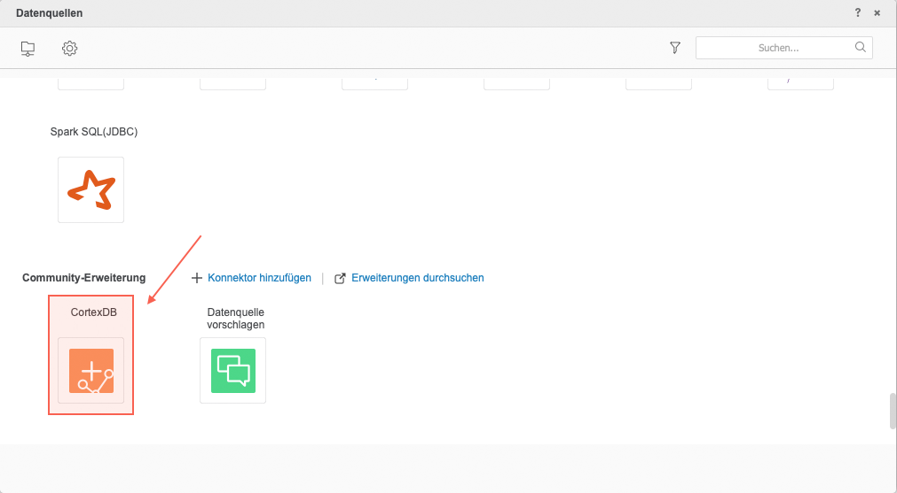

MicroStrategy connector (Prototyp)
==================================

Die englische Übersetzung dieser readme-Datei ist im [selben Verzeichnis](./README.md) zu finden.

Der Connector für [MicroStrategy](https://www.microstrategy.com/) ermöglicht die Verbindung zwischen einer konfigurierten CortexDB mit CortexUniplex und den [MicroStrategy Analytics Tools](https://www.microstrategy.com/).

Voraussetzungen
---------------

Der Connector in dieser Version benötigt den **UniplexDataservice in der Version 4.0.038**. Dieser kann von der Website der [Cortex AG](https://www.cortex-ag.com) mit vorheriger Benutzerregistrierung herunterladenwerden.

Weiterhin ist ein konfigurierter CortexUniplex erforderlich. 

**Hinweis**

Dieser Prototyp verwendet nur den Benutzer `admin` mit einem festen Passwort. Der Benutzer kann im Quellcode geändert werden. Darüber hinaus ist es möglich, eine eigene Authentifizierungsfunktion zu integrieren.

Import dieses Projektes mit dem ctxadmin
----------------------------------------

Starten Sie `ctxadmin` (*CortexDB Remote-Admin*) und öffnen Sie die Plugin-Verwaltung mit der Schaltfläche `Plugins` (in älteren Versionen: *php-plugins*).

Importieren Sie den Ordner mit den Quelldateien (`src`) mit `import dir`. Dadurch werden alle Dateien importiert und in der Datenbank gespeichert. Wenn Sie den Connector weitergeben möchten, können Sie das Plugin in der Liste auswählen und auf "Exportieren" klicken. Das exportiert eine `xjz`-Datei mit dem Namen `CortexMstrConnector.xjz`.

### Version and Name des Connectors

Es ist möglich, den Namen und die Version dieses Connectors zu ändern. Ändern Sie dazu die `config.ini` im Ordner `src`.

```ini
[global]
Name=CortexMstrConnector
Version=1.0.1
```

Konfiguration des CortexHTTP
----------------------------

Je nach Serverkonfiguration ist es notwendig, einige Attribute zur `ctxserver.ini` oder (!!!!) zur `ctxhttpd.ini` hinzuzufügen.

Wenn der CortexDB-Server und der Webserver in einer gemeinsamen Installation (*stand alone*) laufen, müssen die folgenden Zeilen in den ini-Block `HTTPSRV` der `ctxserver.ini` kopiert werden.

Wenn die CortexDB-Datenbank und der Webserver in zwei verschiedenen Prozessen laufen, müssen die folgenden Zeilen in jeden (!!!) `vhost`-Block der `ctxhttpd.ini` kopiert werden.

```ini
HttpHeader=Strict-Transport-Security:
HttpHeader=Content-Security-Policy:
HttpHeader=X-Frame-Options:
HttpHeader=X-XSS-Protection:
HttpHeader=X-Permitted-Cross-Domain-Policies:
SERVERVAR_CORS_ORIGIN=*
```

MicroStrategy Konfiguration
---------------------------

Die folgenden Schritte müssen für die Konfiguration durchgeführt werden:

- Connector hinzufügen
- Verbindungsdaten manuell eingeben

Wenn der CortexDB-Webserver lokal auf Port 80 läuft, kann die folgende URL zum Connector verwendet werden:

```text
http://127.0.0.1/i/CortexMstrConnector/index.html
```
Wenn der CortexDB-Webserver lokal auf einem anderen Port (z.B. 8090) und mit einem `Vhost` läuft, sieht die folgende URL zum Connector so aus:

```text
http://127.0.0.1:8090/myDemoDB/i/CortexMstrConnector/index.html
```

**Hinweis**

Es ist möglich `localhost` anstelle von `127.0.0.1` zu verwenden, aber es kann sein, dass einige lokale Firewalls (Windows oder Mac OS Firewalls) den Zugriff auf localhost blockieren. Dann ist es notwendig, `127.0.0.1` anstelle von `localhost` zu verwenden.

### Die einzelnen Konfigurationsschritte im Detail

Start von MicroStrategy und Hinzufügen einer neuen Datenquelle:


Hinunterscrollen zu `Community-Extensions` und Hinzufügen eines neuen Connector.


Die Verbindungsdetails müssen manuell eingegeben werden:


Eingeben des Namens für den Connector und der URL zu dem importierten Plugin:


Zurück im Hauptfenster muss nur auf die neu hinzugefügte Verbindung geklickt werden:



Die Erweiterung öffnet sich mit den Select-Boxen zur Auswahl der vorkonfigurierten Selektionen (Portale) im CortexUniplex (`portal configuration`):


**Hinweis**

Dieser Prototyp zeigt exemplarisch, wie der UniplexDataservice für einen MicroStrategy-Connector verwendet wird. Dieser kann komplett gegen einen eigenen Connector oder gegen ein eigenes Produkt ausgetauscht oder um weitere Funktionen erweitert werden.
