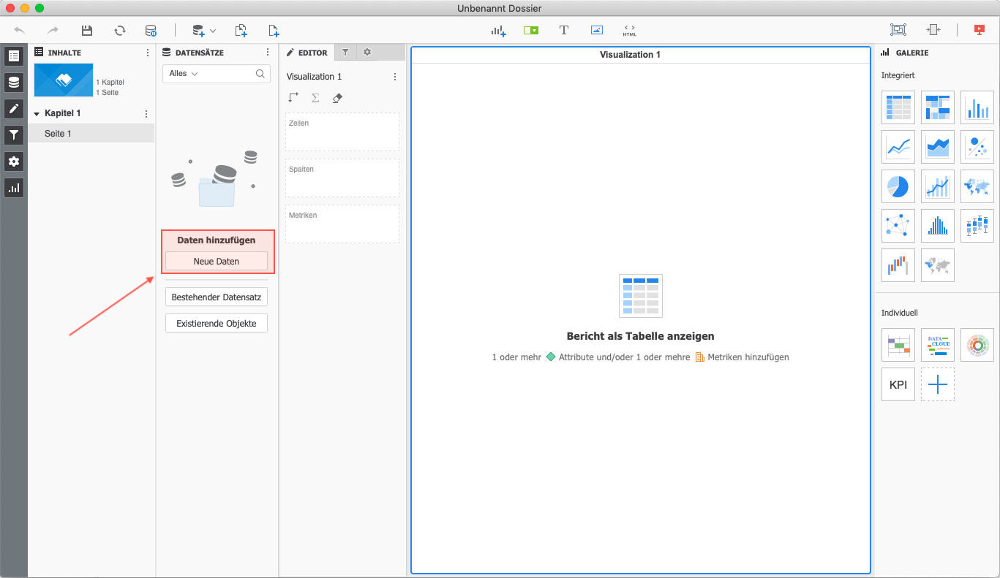
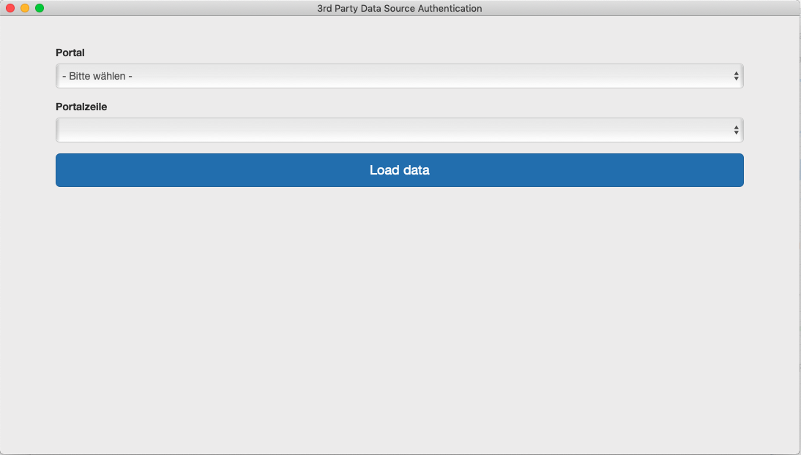

MicroStrategy connector (Prototype)
===================================

You'll find the German translation in the [same folder](./README-de.md).

The Connector for [MicroStrategy](https://www.microstrategy.com/) allows the connection between a configured CortexDB with CortexUniplex and the [MicroStrategy analytics tools](https://www.microstrategy.com/).

Requirements
------------

The connector in this version needs the UniplexDataservice in version 4.0.038. You can download it from the [Cortex AG website](https://www.cortex-ag.com) with a user registration to access the download area.

Furthermore a configured CortexUniplex is necessary. 

**Note**

This Prototype uses only the user `admin` with a fixed password. The user can be changed in the source code. In addition it is possibile to integrate a authentication function.

Import project with ctxadmin
----------------------------

Start `ctxadmin`(*CortexDB Remote-Admin*) and open the plugin administration with the button `plugins` (in older versions: *php-plugins*).

Import the folder with the source files (`src`) with `import dir`. This imports all files and stores them in the database. If you want to distribute the connector, you can select the plugin in the list and click `export`. That exports a `xjz`-file with the name `CortexMstrConnector.xjz`.

### Version and name of connector

It is possible to change the name and version of this connector. To do this, change the `config.ini` in the `src` folder.

```ini
[global]
Name=CortexMstrConnector
Version=1.0.1
```

Configure CortexHTTP
--------------------

Depending on the server configuration it is necessary to add some attributes to the `ctxserver.ini` or (!!!) to the `ctxhttpd.ini`.

If the CortexDB server and webserver runs in a stand alone version, the following lines has to be copied in the ini-block `HTTPSRV` of the `ctxserver.ini`.

If the CortexDB database and the webservers runs in two different processes, the following lines has to be copied in each (!!!) `vhost`-block of the `ctxhttpd.ini`.

```ini
HttpHeader=Strict-Transport-Security:
HttpHeader=Content-Security-Policy:
HttpHeader=X-Frame-Options:
HttpHeader=X-XSS-Protection:
HttpHeader=X-Permitted-Cross-Domain-Policies:
SERVERVAR_CORS_ORIGIN=*
```

MicroStrategy configuration
---------------------------

The following steps must be run for the configuration:

- Add connector
- Enter connection details manually

If the CortexDB webserver runs locally on port 80, the following URL to the connector can be used:

```text
http://127.0.0.1/i/CortexMstrConnector/index.html
```

If the CortexDB webserver runs locally on a different port (for example 8090) and with a `vhost`, the following URL to the connector looks like that:

```text
http://127.0.0.1:8090/myDemoDB/i/CortexMstrConnector/index.html
```

**Note**

It is possible to use `localhost` instead of `127.0.0.1`, but it can be that some local firewall (windows or Mac OS firewalls) are blocking the acces to localhost. Then it is necessary to use `127.0.0.1` instead of `localhost`.


### connector configuration steps in details

Start MicroStrategy and add new data:



Scroll down to `Community-Extensions` and add a new connector.


The connection details has to be entered manually:


Enter a name for the connector and enter the URL to the connector which was imported to the CortexDB:


Back to the MicroStrategy sources click on the new extension:


The tool opens with select boxes for the configured preselections of the CortexUniplex (`portal configuration`).




**Note**

This prototype show as example how to use the dataservice for a MicroStrategy connector. It can be completely changed for an own connector or for an own product.

